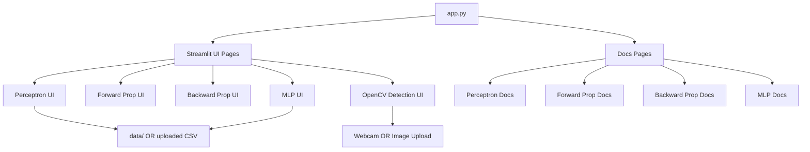
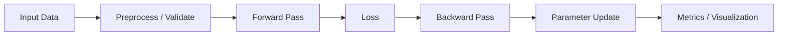

# Neural Network Toolbox


[](https://nn-tool-box.streamlit.app/)

An interactive Streamlit app for learning core neural network concepts and computer vision techniques. The app includes hands-on modules for perceptron, forward propagation, backward propagation, multi-layer perceptron (MLP), and OpenCV-based object detection with visualizations and dataset support.

<a href="https://nn-tool-box.streamlit.app/" target="_blank">
   Click Here to Open the App
</a>

<span style="color: #6c757d;">Since it's freely deployed, you may need to wake up the app.</span>

## Highlights

- Interactive, educational UI built with Streamlit
- Perceptron training with logic gates or custom CSV
- Forward and backward propagation walkthroughs
- MLP classifier with binary and multiclass support
- OpenCV-based detection (Face, Eye, Smile, Stop Sign, Face Count)
- Real-time webcam detection and image upload support
- Built-in sample datasets (AND, IRIS) and detection samples

## Project Structure

```
.
├─ app.py
├─ requirements.txt
├─ data/
│  ├─ AND.csv
│  └─ IRIS.csv
└─ src/
   ├─ assets/
   │  └─ documnets/
   │     ├─ back_propagation.py
   │     ├─ forward_propagation.py
   │     ├─ mnp.py
   │     └─ perceptron.py
   ├─ core/
   │  └─ perceptron.py
   ├─ open_cv/
   │  ├─ cascades/
   │  ├─ sample/
   │  └─ open_cv_detection.py
   └─ ui/
      ├─ backward_propagation.py
      ├─ forward_propagation.py
      ├─ mlp.py
      └─ perceptron_ui.py
```

## Architecture Overview



## Module Flow



## Requirements

- Python 3.9+
- Packages listed in [requirements.txt](requirements.txt)

## Quick Start

1. Create and activate a virtual environment
2. Install dependencies
3. Run the Streamlit app

```bash
python -m venv .venv
. .venv/Scripts/activate
pip install -r requirements.txt
streamlit run app.py
```

## Usage

- Use the sidebar to choose a module or open documentation pages.
- For Perceptron and MLP modules, select a logic gate or upload a CSV file.
- For OpenCV Detection, choose detection type (Face, Eye+Smile, Stop Sign, Face Count).
- Select input method: webcam for real-time detection or upload/sample images.
- Configure parameters and run training/detection to visualize results.

## Data Input Rules

- **Perceptron**: Expects exactly two binary feature columns and a binary target.
- **MLP**: Supports binary or multiclass targets and handles numeric and categorical features.
- **OpenCV Detection**: Accepts webcam feed or image files (JPG, JPEG, PNG). Uses Haar Cascade classifiers.
- Large datasets are rejected to keep performance stable in the UI.

## Notes

- This project is educational and focuses on explainability over performance.
- The MLP module includes basic preprocessing (standardization and one-hot encoding).

## License

MIT License - free to use, modify, and share for learning and beyond.
