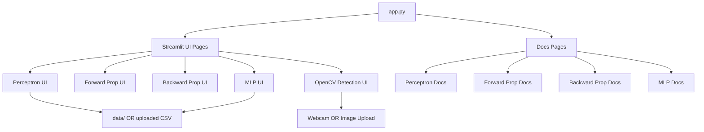
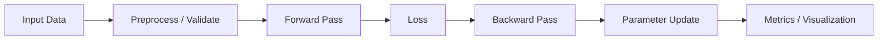

# Neural Network Toolbox


[](https://nn-tool-box.streamlit.app/)

An interactive **Streamlit-based learning toolbox** for understanding core **Neural Network concepts** and **Computer Vision techniques** through hands-on experimentation and visualizations.

**Live App**: https://nn-tool-box.streamlit.app/
> Since it's freely deployed, the app may need a few seconds to wake up.

---

## Highlights

- Interactive, educational UI built with Streamlit
- Perceptron training with logic gates or custom CSV
- Forward and backward propagation walkthroughs
- Multi-Layer Perceptron (MLP) with binary & multiclass support
- OpenCV-based object detection:
  - Face
  - Eye + Smile
  - Stop Sign
  - Face Count
- Real-time webcam detection & image upload
- Built-in sample dataset (IRIS)

---

## Getting Started

### 1️⃣ Clone the repository

```bash
git clone https://github.com/Prateekkp/nn_toolbox.git
cd nn_toolbox
```

### 2️⃣ Create & activate a virtual environment

```powershell
python -m venv .venv
```
```powershell
.venv\Scripts\activate
```

### 3️⃣ Install dependencies

```bash
pip install -r requirements.txt
```

### 4️⃣ Run the app

```bash
streamlit run app.py
```

The app will open automatically at `http://localhost:8501`.

---

## Project Structure

```
.
├── app.py                    # Main Streamlit entry point
├── requirements.txt
│
├── data/
│   └── IRIS.csv              # Sample dataset
│
└── src/
    ├── __init__.py
    │
    ├── assets/
    │   ├── image/
    │   │   └── nn_image.jpg  # Home page banner
    │   └── documents/        # In-app documentation pages
    │       ├── perceptron.py
    │       ├── forward_propagation.py
    │       ├── back_propagation.py
    │       └── mnp.py
    │
    ├── ui/                   # Interactive module pages
    │   ├── perceptron_ui.py
    │   ├── forward_propagation.py
    │   ├── backward_propagation.py
    │   └── mlp.py
    │
    └── open_cv/              # OpenCV detection module
        ├── open_cv_detection.py
        ├── cascades/         # Haar cascade XML files
        └── sample/           # Sample images for demo
```

---

## Architecture Overview



---

## Module Flow



---

## Usage Guide

- Use the **sidebar** to navigate between modules or documentation pages
- **Perceptron / MLP**
  - Select logic gates or upload a CSV file
  - Tune learning parameters and train
- **OpenCV Detection**
  - Choose a detection type (Face, Eye+Smile, Stop Sign, Face Count)
  - Use webcam, upload a video, or upload an image
- Visualize training behavior and results interactively

---

## Data Input Rules

- **Perceptron** — exactly 2 binary feature columns + binary target
- **MLP** — numeric & categorical features; binary or multiclass target
- **OpenCV** — webcam, image files (JPG/JPEG/PNG), or video files
- Large datasets are restricted to maintain UI performance

---

## Dependencies

| Package | Purpose |
|---|---|
| `streamlit` | Web UI framework |
| `numpy` | Numerical computation |
| `pandas` | Data handling |
| `plotly` | Interactive charts |
| `opencv-python` | Computer vision |
| `streamlit-webrtc` | Real-time webcam on cloud |
| `av` | Video processing |

---

## Notes

- This project prioritizes **learning & explainability** over raw performance
- MLP module includes standardization and one-hot encoding
- Designed for **students, demos, and concept clarity**

---

## License

MIT License — free to use, modify, and share for learning and beyond.
