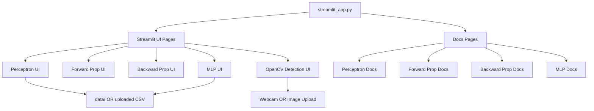
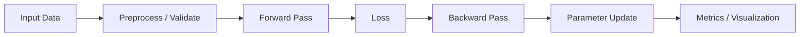

# Neural Network Toolbox


[](https://nn-tool-box.streamlit.app/)

An interactive **Streamlit-based learning toolbox** for understanding core **Neural Network concepts** and **Computer Vision techniques** through hands-on experimentation and visualizations.

👉 **Live App**: https://nn-tool-box.streamlit.app/  
> Since it's freely deployed, the app may need a few seconds to wake up.

---

## Highlights

- Interactive, educational UI built with Streamlit
- Perceptron training with logic gates or custom CSV
- Forward and backward propagation walkthroughs
- Multi-Layer Perceptron (MLP) with binary & multiclass support
- OpenCV-based object detection:
  - Face
  - Eye + Smile
  - Stop Sign
  - Face Count
- Real-time webcam detection & image upload
- Built-in sample datasets (AND, IRIS)
- **CLI-based launcher (`nntoolbox`) for local use**

---

## Installation (Recommended)

This project provides a **clean installer** that hides pip noise and ensures a smooth setup.

### 1️⃣ Clone the repository

```bash
git clone https://github.com/Prateekkp/nn_toolbox.git
cd nn_toolbox
```

### 2️⃣ Create & activate virtual environment

```powershell
python -m venv .venv
. .venv\Scripts\activate
```

### 3️⃣ Run the installer

```powershell
Set-ExecutionPolicy -Scope Process -ExecutionPolicy Bypass
.\install_nntoolbox.ps1
```

You’ll see a clean progress bar and a success message.

### 4️⃣ Launch the app

```bash
nntoolbox
```

The Streamlit app will open automatically in your browser.

---

## Developer Installation (Editable Mode)

If you are developing or modifying the project:

```bash
pip install -e . -q
nntoolbox
```

> This installs the package in editable mode inside the active virtual environment.

---

## Project Structure

```
.
├─ nntoolbox/
│  ├─ __init__.py
│  └─ cli.py              # CLI launcher (nntoolbox)
│
├─ streamlit_app.py       # Pure Streamlit app (no CLI logic)
├─ install_nntoolbox.ps1  # Clean installer (recommended)
├─ setup.py
├─ requirements.txt
│
├─ data/
│  ├─ AND.csv
│  └─ IRIS.csv
│
└─ src/
   ├─ assets/
   │  └─ documnets/
   │     ├─ back_propagation.py
   │     ├─ forward_propagation.py
   │     ├─ mnp.py
   │     └─ perceptron.py
   │
   ├─ core/
   │  └─ perceptron.py
   │
   ├─ open_cv/
   │  ├─ cascades/
   │  ├─ sample/
   │  └─ open_cv_detection.py
   │
   └─ ui/
      ├─ backward_propagation.py
      ├─ forward_propagation.py
      ├─ mlp.py
      └─ perceptron_ui.py
```

---

## Architecture Overview



---

## Module Flow



---

## Usage Guide

* Use the sidebar to choose modules or documentation pages
* **Perceptron / MLP**

  * Select logic gates or upload CSV files
  * Tune learning parameters
* **OpenCV Detection**

  * Choose detection type
  * Use webcam or upload images
* Visualize training behavior and results interactively

---

## Data Input Rules

* **Perceptron**

  * Exactly 2 binary feature columns
  * Binary target
* **MLP**

  * Binary or multiclass targets
  * Supports numeric & categorical features
* **OpenCV Detection**

  * Webcam or image files (JPG, JPEG, PNG)
  * Haar Cascade-based detection
* Large datasets are restricted to maintain UI performance

---

## Notes

* This project prioritizes **learning & explainability** over raw performance
* MLP module includes:

  * Standardization
  * One-hot encoding
* Designed for **students, demos, and concept clarity**

---

## License

MIT License — free to use, modify, and share for learning and beyond.
