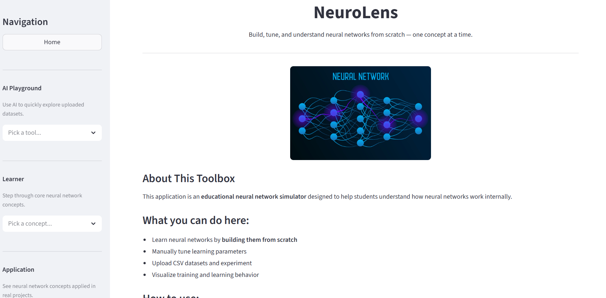
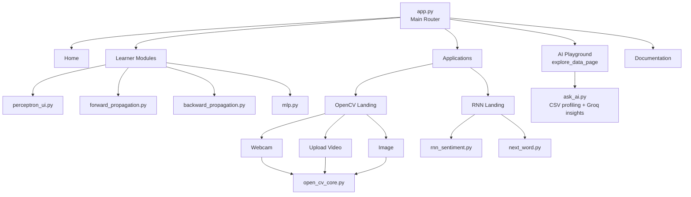
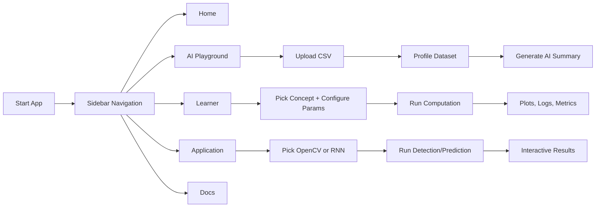

# Neural Network Toolbox (NeuroLens)


[](https://nn-tool-box.streamlit.app/)

Interactive Streamlit toolbox for learning neural-network fundamentals and exploring practical applications in computer vision and NLP.



Live app: https://nn-tool-box.streamlit.app/

## What This Project Does

- Learner modules for perceptron, forward propagation, backward propagation, and MLP training.
- Application modules for OpenCV detection and RNN-based text tools.
- AI Playground for CSV profiling + LLM-generated structured dataset insights.
- Built-in assets and sample data for quick experimentation.

## Who This Is For

- Students learning neural-network concepts step by step.
- Instructors/demo presenters who need interactive visual teaching tools.
- Beginners who want practical, visual ML examples without heavy setup.
- Developers who want a compact reference implementation of Streamlit-based ML demos.

## Architecture Overview


```mermaid
flowchart TB
    APP[app.py\nMain Router] --> HOME[Home]
    APP --> AI[AI Playground\nexplore_data_page]
    APP --> LEARN[Learner Modules]
    APP --> APPS[Applications]
    APP --> DOCS[Documentation]

    LEARN --> PERC[perceptron_ui.py]
    LEARN --> FWD[forward_propagation.py]
    LEARN --> BWD[backward_propagation.py]
    LEARN --> MLP[mlp.py]

    APPS --> OCV[OpenCV Landing]
    APPS --> RNN[RNN Landing]

    OCV --> OCVW[Webcam]
    OCV --> OCVV[Upload Video]
    OCV --> OCVI[Image]
    OCVW --> CORE[open_cv_core.py]
    OCVV --> CORE
    OCVI --> CORE

    RNN --> SENT[rnn_sentiment.py]
    RNN --> NEXT[next_word.py]

    AI --> ASK[ask_ai.py\nCSV profiling + Groq insights]
```

## App Flow


```mermaid
flowchart LR
    START[Start App] --> NAV[Sidebar Navigation]
    NAV --> HOME[Home]
    NAV --> AI[AI Playground]
    NAV --> LEARN[Learner]
    NAV --> APPS[Application]
    NAV --> DOCS[Docs]

    AI --> UPLOAD[Upload CSV]
    UPLOAD --> PROFILE[Profile Dataset]
    PROFILE --> LLM[Generate AI Summary]

    LEARN --> CONFIG[Pick Concept + Configure Params]
    CONFIG --> RUN[Run Computation]
    RUN --> VIZ[Plots, Logs, Metrics]

    APPS --> PICK[Pick OpenCV or RNN]
    PICK --> INFER[Run Detection/Prediction]
    INFER --> OUTPUT[Interactive Results]
```

## Project Structure (Current, Testing Folder Excluded)

```text
.
├── app.py
├── packages.txt
├── requirements.txt
├── data/
│   ├── IRIS.csv
│   └── images/
│       └── image.png
└── src/
    ├── ai_playground_pages/
    │   └── ask_ai.py
    ├── application_pages/
    │   ├── open_cv/
    │   │   ├── open_cv_core.py
    │   │   ├── open_cv_detection.py
    │   │   ├── open_cv_image.py
    │   │   ├── open_cv_landing.py
    │   │   ├── open_cv_shared.py
    │   │   ├── open_cv_video.py
    │   │   └── open_cv_webcam.py
    │   └── rnn/
    │       ├── next_word.py
    │       ├── rnn_landing.py
    │       └── rnn_sentiment.py
    ├── learner_pages/
    │   ├── perceptron_ui.py
    │   ├── forward_propagation.py
    │   ├── backward_propagation.py
    │   └── mlp.py
    └── assets/
        ├── documents/
        ├── image/
        ├── open_cv/
        ├── palm/
        ├── rnn/
        ├── config.pkl
        ├── rnn_model.pth
        └── word2idx.pkl
```

## Module Summary

### AI Playground

- Upload CSV (up to 50 MB).
- Automatic profiling: shape, types, missing values, duplicates, basic stats, correlations.
- LLM summary response includes problem-type guess, target guess, risks, preprocessing suggestions, and candidate models.
- Uses Groq API via `GROQ_API_KEY` from Streamlit Secrets or environment.

### Learner Modules

- Perceptron: logic-gate or custom CSV workflows, rich data validation, training logs, and visual diagnostics.
- Forward Propagation: configurable architecture and activations with layer-wise inference visualization.
- Backward Propagation: gradient flow and derivative/loss tracing.
- MLP: binary/multiclass classification flow with preprocessing, training curves, and confusion matrix.

### Applications

- OpenCV:
  - Detection types: Face, Eye+Smile, Stop Sign, Real-Time Face Count.
  - Input modes: Webcam, Upload Video, Image.
  - Local/cloud-aware webcam path (cv2 locally, WebRTC fallback on cloud).
- RNN:
  - Sentiment Analyzer (IMDB-style binary sentiment).
  - Next Word Predictor (WikiText-2 based).
  - Optional text refinement via NVIDIA API key.

## Getting Started

### 1. Clone

```bash
git clone https://github.com/Prateekkp/nn_toolbox.git
cd nn_toolbox
```

### 2. Create and activate virtual environment

```powershell
python -m venv .venv
.venv\Scripts\activate
```

### 3. Install dependencies

```bash
pip install -r requirements.txt
```

### 4. Configure environment variables

Local `.env` example:

```env
GROQ_API_KEY=gsk_xxxxxxxxxxxx
NVIDIA_API_KEY=nvapi_xxxxxxxxxxxx
```

For Streamlit Cloud, add secrets in App Settings -> Secrets:

```toml
GROQ_API_KEY = "gsk_xxxxxxxxxxxx"
NVIDIA_API_KEY = "nvapi_xxxxxxxxxxxx"
```

### 5. Run

```bash
streamlit run app.py
```

## Key Dependencies

- streamlit
- pandas, numpy
- plotly
- opencv-python-headless
- streamlit-webrtc, av
- torch
- scikit-learn, xgboost, statsmodels
- python-dotenv
- requests
- SpeechRecognition
- mediapipe

## Notes

- Designed primarily for education and concept clarity.
- Some modules rely on pretrained assets included in `src/assets`.
- Cloud deployment may have webcam/runtime limitations compared to local runs.

## License

MIT
